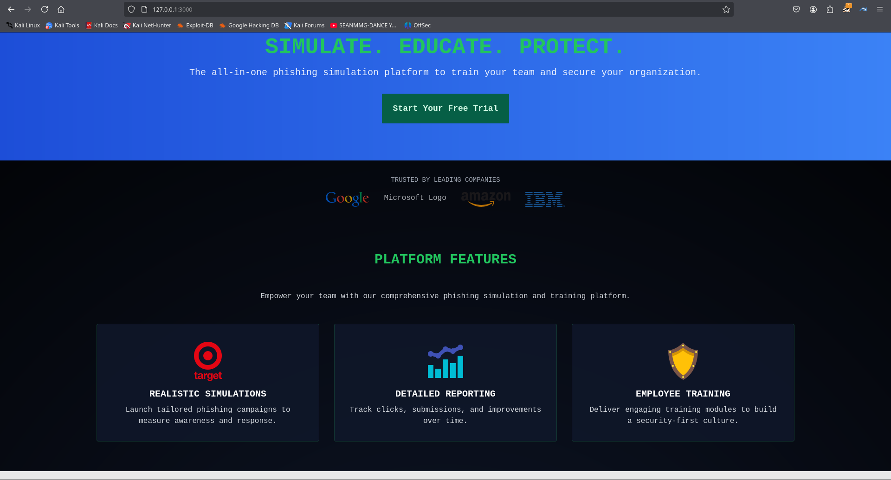

# NetGuardIQ
NetGuardIQ is a cloud-based Phishing Simulation and Security Awareness Training Platform. It empowers organizations to simulate real-world phishing attacks, track user behavior, and educate employees to identify and avoid threats.

